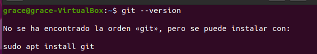

# Instalación de Git en la versión por defecto

Se trata de una forma rápida de instalarlo usando los paquetes que tenemos por defecto, el inconveniente es que normalmente no es la última versión, en el caso de querer la última versión o una concreta tendremos que dirigirnos al siguiente apartado: Instalación de una versión concreta.   

Antes de empezar la instalación comprobaremos si está instalado o no y en caso de estarlo que versión tiene escribiendo lo siguiente en la terminal:

```
git –version
```

<div align="center">
    
</div>

Como podemos ver en la imagen anterior, aún no tenemos instalado GIT. En caso de que si esté instalado podemos pasar directamente al apartado: Configuración de GIT
Como aún no lo tenemos instalado vamos a empezar por actualizar los paquetes, con el siguiente comando:
sudo apt update
 
Como vemos en la imagen anterior no se ha actualizado correctamente en mi caso se debe a que tengo una actualización en proceso. 
 
Una vez mi actualización ha finalizado lo he vuelto a hacer y no ha habido problema como vemos en la imagen anterior.
Ahora que ya están actualizados los paquetes vamos a proceder a la instalación con lo siguiente:
sudo apt install git
 
Nos preguntará si queremos continuar después de informarnos que se descargarán archivos y se utilizará espacio en disco, para poder continuar con la instalación escribiremos:
	s 
 
Una vez confirmemos continuar con la instalación el proceso tardará un par de minutos y veremos algo como lo siguiente durante el proceso:
 
Una vez este proceso acabe la instalación ya estaría completada. Para comprobarlo y comprobar la versión escribiremos el siguiente comando:
git –version
 
Como podemos observar GIT se ha instalado correctamente y tenemos instalada la versión 2.25.1. Para configurarlo pasaremos al apartado: Configuración de GIT
Instalación de una versión concreta
Esta forma de instalación nos llevará un poco más de tiempo que la anterior pero nos permitirá instalar una versión concreta de GIT. Para ello comprobaremos la versión que tenemos instalada en caso de tenerla con el siguiente comando:
	git –version
 
Como podemos ver ya tenemos la versión 2.25.1.
Antes de comenzar con la instalación deberemos actualizar los paquetes escribiendo lo siguiente:
sudo apt update
 
A continuación instalaremos las dependencias necesarias con el siguiente comando:
	sudo apt install libz-dev libssl-dev libcurl4-gnutls-dev libexpat1-dev gettext cmake gcc
 
En mitad de la instalación nos preguntará si deseamos continuar con la instalación y diremos que si con una:
s
 
Ahora creamos un directorio temporal y accederemos a él de la siguiente manera:
	mkdir tmp
	cd /tmp
 
Ahora nos dirigiremos a la web del proyecto GIT: 
	https://mirrors.edge.kernel.org/pub/software/scm/git/
 
 Buscaremos la última versión en mi caso la versión 2.33.1 es la última que hay en el momento en que he realizado la documentación. Utilizaremos curl para descargar el archivo y lo envíe a git.tar.gz.
	curl -o git.tar.gz https://mirrors.edge.kernel.org/pub/software/scm/git/git-2.29.3.tar.gz
 
Como podemos observar debemos instalar curl y lo haremos de la siguiente manera:
	sudo apt install curl
 
Una vez instalado volvemos a hacer:
	curl -o git.tar.gz https://mirrors.edge.kernel.org/pub/software/scm/git/git-2.29.3.tar.gz
 
Luego descomprimimos el archivo tarball:
	tar -zxf git.tar.gz
 
Una vez descomprimido el archivo nos dirigiremos al directorio de GIT:
	cd git-*
 
A continuación crearemos el paquete:
	make prefix=/usr/local all
 

Una vez creado el paquete lo instalaremos con el siguiente comando:
	sudo make prefix=/usr/local install
 
Para finalizar escribiremos lo siguiente:
	exec bash
 

Llegados a este punto la instalación debe de haberse completado satisfactoriamente. Lo comprobamos con el siguiente comando:
	git --version
 

Como podemos observar GIT se ha instalado correctamente y tenemos instalada la versión 2.33.1. Para configurarlo pasaremos al apartado: Configuración de GIT
Configuración de Git
Una vez tenemos la versión de GIT que queremos pasamos a configurarlo para que muestre información sobre nosotros cada vez que creamos un proyecto.
Para ello usaremos el comando git config a continuación configuraremos nuestro nombre y nuestro email
git config --global user.name "Your Name"
 
git config --global user.email "youremail@domain.com"
 
Podemos ver datos de configuración creados escribiremos lo siguiente:
	git config --list
 
Con esto queda finalizada la configuración de nuestro GIT.

El siguiente enlace es para acceder al repositorio de la instalación de GIT.
