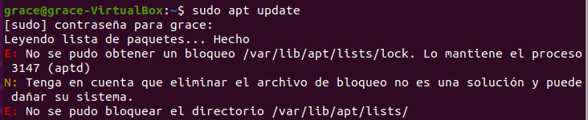
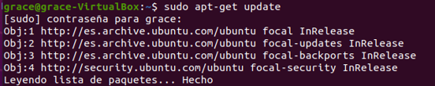
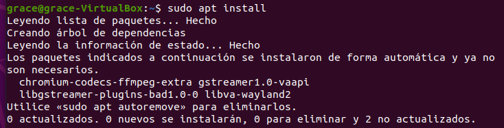
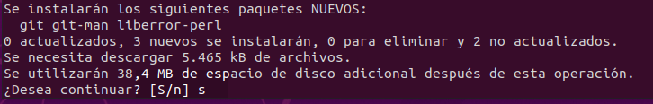
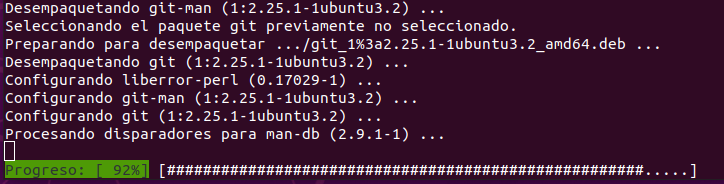

# Instalación de Git en la versión por defecto

Se trata de una forma rápida de instalarlo usando los paquetes que tenemos por defecto, el inconveniente es que normalmente no es la última versión, en el caso de querer la última versión o una concreta tendremos que dirigirnos al siguiente apartado: [Instalación de una versión concreta](Git-version.md).

## A tener en cuenta

Antes de empezar la instalación comprobaremos si está instalado o no y en caso de estarlo que versión tiene escribiendo lo siguiente en la terminal:

```
git –version
```

<div align="center">
    
</div>

Como podemos ver en la imagen anterior, aún no tenemos instalado GIT. En caso de que si esté instalado podemos pasar directamente al apartado: [Configuración de Git](Git-configuracion.md)  

## Instalación

Como aún no lo tenemos instalado vamos a empezar por actualizar los paquetes, con el siguiente comando:
```
sudo apt update
```
<div align="center">
    
</div>
 
Como vemos en la imagen anterior no se ha actualizado correctamente en mi caso se debe a que tengo una actualización en proceso. 
<div align="center">
    
</div>

Una vez mi actualización ha finalizado lo he vuelto a hacer y no ha habido problema como vemos en la imagen anterior.		

Ahora que ya están actualizados los paquetes vamos a proceder a la instalación con lo siguiente:  

```
sudo apt install git
```
<div align="center">
    
</div>

Nos preguntará si queremos continuar después de informarnos que se descargarán archivos y se utilizará espacio en disco, para poder continuar con la instalación escribiremos:

```
s 
```
<div align="center">
    
</div>

Una vez confirmemos continuar con la instalación el proceso tardará un par de minutos y veremos algo como lo siguiente durante el proceso:

<div align="center">
    
</div>

Una vez este proceso acabe la instalación ya estaría completada. Para comprobarlo y comprobar la versión escribiremos el siguiente comando:
```
git –version
```
<div align="center">
    
</div>

Como podemos observar GIT se ha instalado correctamente y tenemos instalada la versión **2.25.1**.		
Para configurarlo pasaremos al apartado: [Configuración de Git](Git-configuracion.md).
