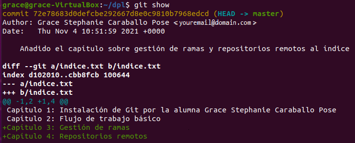

# Manipulación de repositorios en Git
A continuación veremos algunos comandos básicos para crear y manejar archivos en GIT. Lo haremos en una máquina con Ubuntu 20.04 a través de la terminal. Si no tenemos aún instalado GIT podemos hacerlo siguiendo los pasos de [Instalación de GIT en Linux](https://github.com/GraceCaraballoP/Instalaci-n-Git/blob/main/Git-defecto.md).

## Configurar GIT
Vamos a realizar la configuración básica introduciendo el nombre de usuario, su email y activar el color de salida automático.    
Para ello vamos a introducir los siguientes comandos en la terminal:  
```
git config --global user.name "Your-Full-Name"
git config --global user.email "your-email-address"
git config --global color.ui auto
```
<div align="center">
  
</div>

Una vez hechas las configuraciones anteriores vamos a comprobarlas haciendo un listado de la configuración actual de la siguiente manera:
```
git config –list
```
<div align="center">
  
</div>

## Crear un repositorio
Para crear un repositorio comenzaremos por crear un directorio llamado **dpl** y accederemos a él con los siguientes comandos:
```
mkdir dpl
cd dpl
```
<div align="center">
  
</div>

Una vez dentro del directorio lo convertiremos en un repositorio con lo siguiente:
```
git init
```
<div align="center">
  
</div>

Con el repositorio creado mostraremos su contenido con el siguiente comando:
```
ls –la
```
<div align="center">
  
</div>


## Comprobar el estado del repositorio
Para comprobar el estado de nuestro repositorio solo tendremos que hacer lo siguiente:
```
git status
```
<div align="center">
  
</div>

Una vez comprobado el estado crearemos un fichero llamado **indice.txt** que contenga lo siguiente:   
***Capítulo 1: Instalación de Git por el alumno (nombre del alumno)    
Capítulo 2: Flujo de trabajo básico***

El fichero lo crearemos el comando **cat** como se muestra a continuación:
```
cat > indice.txt
Capítulo 1: Instalación de Git por el alumno nombre del alumno
Capítulo 2: Flujo de trabajo básico
```

Cuando tengamos escrito lo que queremos solo tenemos que cerrar el fichero con **Ctrl+D**, esto se haría como se ve a continuación: 
<div align="center">
  
</div>
 
Con el fichero **indice.txt** creado, volveremos a comprobar el estado para ver si ha habido algún cambio:
```
git status
```
<div align="center">
  
</div>

Como podemos observar el fichero **indice.txt** no tiene seguimiento, para poder añadirlo a la zona de intercambio lo haremos con el comando **git add + (nombre del fichero)**:
```
git add indice.txt
```
<div align="center">
  
</div>

Añadido el fichero a la zona de intercambio volveremos a comprobar su estado:
```
git status
``` 
<div align="center">
  
</div>

## Realizar los Commit
Para realizar un **commit** de lo anterior solo tendremos que usar el comando siguiente **git commit –m "descripción del commit"**:
```
git commit -m "Añadido índice de la asignatura DPL."
```
<div align="center">
  
</div>

Como podemos observar en nuestro caso la **"descripción del commit"** es **"Añadido índice de la asignatura DPL"**.   
Una vez realizado el commit comprobaremos el estado de nuestro repositorio:
```
git status
```
<div align="center">
  
</div>

## Modificación de ficheros
Modificaremos el fichero índice.txt y le añadiremos los Capítulos 3 y 4, y el fichero deberá quedarnos de la siguiente manera:    
***Capítulo 1: Instalación de Git por el alumno (nombre del alumno)   
Capítulo 2: Flujo de trabajo básico   
Capítulo 3: Gestión de ramas    
Capítulo 4: Repositorios remotos***   

Para escribir en el fichero usaremos como antes el comando **cat** como se muestra a continuación:
```
cat > indice.txt
Capítulo 1: Instalación de Git por el alumno nombre del alumno
Capítulo 2: Flujo de trabajo básico
Capítulo 3: Gestión de ramas
Capítulo 4: Repositorios remotos
```
Cuando tengamos escritos los capítulos anteriores y los dos nuevos capítulos solo tenemos que cerrar el fichero con **Ctrl+D**, esto se haría como se ve a continuación: 
<div align="center">
  
</div>

Para ver las diferencias con la última versión que tenemos guardada en el repositorio lo haremos con lo siguiente:
```
git diff
```
<div align="center">
  
</div>

Una vez vistas las diferencias, añadiremos el fichero **índice.txt** a la zona de intercambio al igual que hemos hecho anteriormente con el comando **git add**.
```
git add indice.txt
```
 <div align="center">
  
</div>

Para finalizar haremos un **commit** de las modificaciones con la descripción **"Añadido los capítulos 3 y 4"**.
```
git commit -m "Añadido los capítulos 3 y 4"
```
<div align="center">
  
</div>

## Ver historial
Para poder ver los cambios hechos al repositorio con respecto a la versión anterior lo haremos con **git show**.
```
git show
```
<div align="center">
  
</div>

Para modificar el mensaje que aparece en el último commit lo haremos como se muestra a continuación:
```
git commit --amend -m "Añadido el capítulo sobre gestión de ramas al índice"
```
<div align="center">
  
</div>

Una vez modificado el último commit volveremos a pedir que nos muestre los últimos cambios realizados en el repositorio.
```
git show
``` 
<div align="center">
  
</div>
