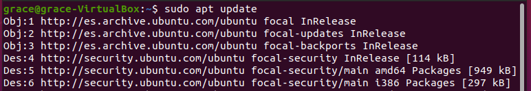
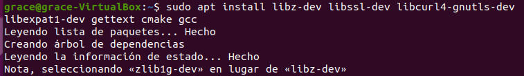
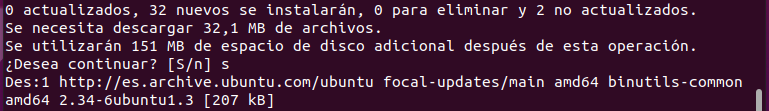
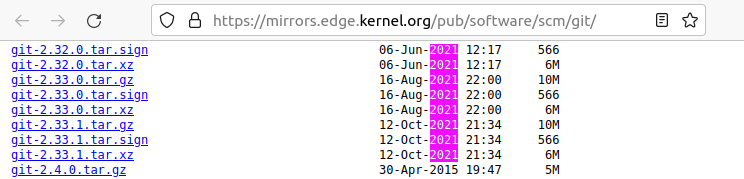
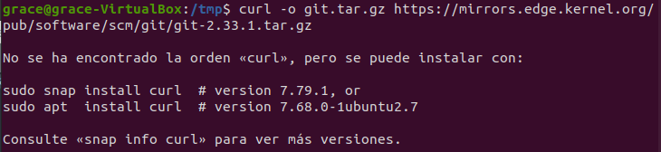
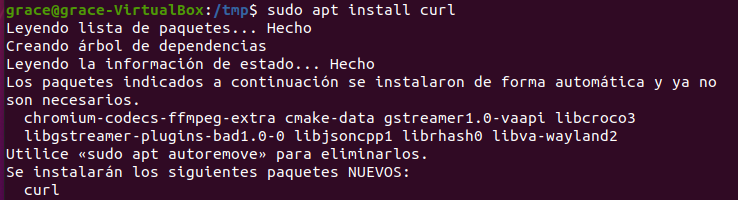
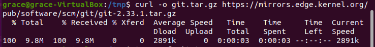
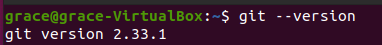

# Instalación de una versión concreta de Git

Esta forma de instalación nos llevará un poco más de tiempo que la anterior pero nos permitirá instalar una versión concreta de GIT.    
## A tener en cuenta
Para ello comprobaremos la versión que tenemos instalada en caso de tenerla con el siguiente comando:
```
git –version
```
<div align="center">
  
</div>

Como podemos ver ya tenemos la versión **2.25.1**.
Antes de comenzar con la instalación deberemos actualizar los paquetes escribiendo lo siguiente:
```
sudo apt update
```
<div align="center">
  
</div>

A continuación instalaremos las dependencias necesarias con el siguiente comando:
```
sudo apt install libz-dev libssl-dev libcurl4-gnutls-dev libexpat1-dev gettext cmake gcc
```
<div align="center">
  
</div>

En mitad de la instalación nos preguntará si deseamos continuar con la instalación y diremos que si con una:
```
s
```
<div align="center">
  
</div>

Ahora creamos un directorio temporal y accederemos a él de la siguiente manera:
```
mkdir tmp
cd /tmp
```
<div align="center">
  
</div>

Ahora nos dirigiremos a la web del proyecto GIT, piedes hacerlo clicando el [enlace](https://mirrors.edge.kernel.org/pub/software/scm/git/)   

<div align="center">
  
</div>

Buscaremos la última versión en mi caso la versión **2.33.1** es la última que hay en el momento en que he realizado la documentación.    
Utilizaremos curl para descargar el archivo y lo envíe a **git.tar.gz**.
```
curl -o git.tar.gz https://mirrors.edge.kernel.org/pub/software/scm/git/git-2.29.3.tar.gz
```

<div align="center">
  
</div>

Como podemos observar debemos instalar curl y lo haremos de la siguiente manera:
```
sudo apt install curl
```
<div align="center">
  
</div>

Una vez instalado volvemos a hacer:
```
curl -o git.tar.gz https://mirrors.edge.kernel.org/pub/software/scm/git/git-2.33.1.tar.gz
```
<div align="center">
  
</div>

Luego descomprimimos el archivo tarball:
```
tar -zxf git.tar.gz
```
<div align="center">
  
</div>

Una vez descomprimido el archivo nos dirigiremos al directorio de GIT:
```
cd git-*
```
<div align="center">
  
</div>

A continuación crearemos el paquete:
```
make prefix=/usr/local all
```
<div align="center">
  
</div>

Una vez creado el paquete lo instalaremos con el siguiente comando:
```
sudo make prefix=/usr/local install
```
<div align="center">
  
</div>

Para finalizar escribiremos lo siguiente:
```
exec bash
```
<div align="center">
  
</div>


Llegados a este punto la instalación debe de haberse completado satisfactoriamente, lo comprobamos con el siguiente comando:
```
git --version
```
<div align="center">
  
</div>


Como podemos observar GIT se ha instalado correctamente y tenemos instalada la versión **2.33.1**.    
Para configurarlo pasaremos al apartado: [Configuración de Git](Git-configuracion.md)
